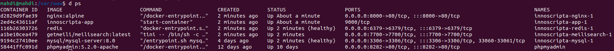
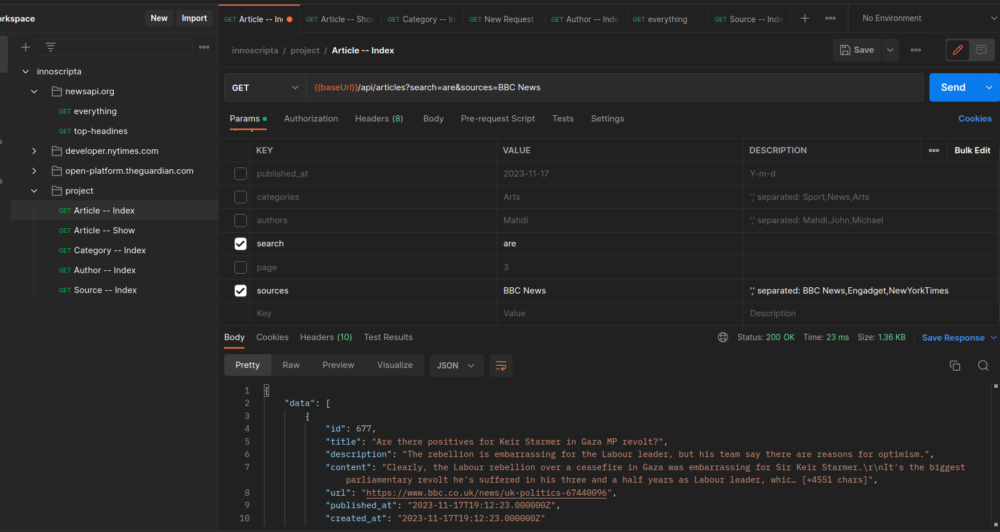

# Innoscripta Article App
## `Intro`
Article Application is an app that pulls articles from 3 sources (Guardian, New-York-Times, News-Api) each day usig scheduled commands.

## `Setup`
### Clone the project

```bash
git clone git@github.com:mahdi375/article-bank.git
```

### Copy env
```bash
cp ./.env.example .env
```

### Modify env file if desired
---
### Set up docker containers
```bash
docker compose up -d
```
> `It takes about 15 sec to make all containers up (health checking), after building docker images`

### Run seeders
```bash
docker exec -it innoscripta-app-1 php artisan db:seed --class=SourceSeeder
```

### Run article fetchers
```bash
docker exec -it innoscripta-app-1 php artisan app:fetch-articles Guardian
docker exec -it innoscripta-app-1 php artisan app:fetch-articles New-York-Times
docker exec -it innoscripta-app-1 php artisan app:fetch-articles News-Api
```

---

### Screenshots
- docker containers
    
    
- postman collection
    